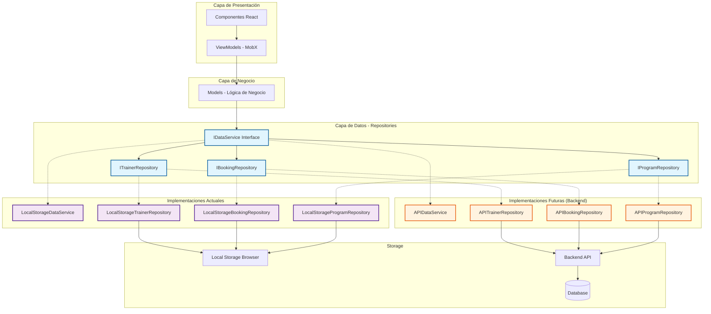
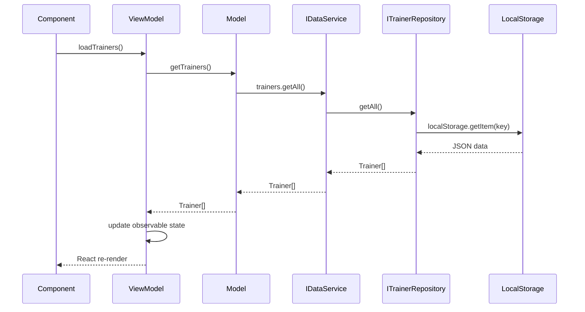
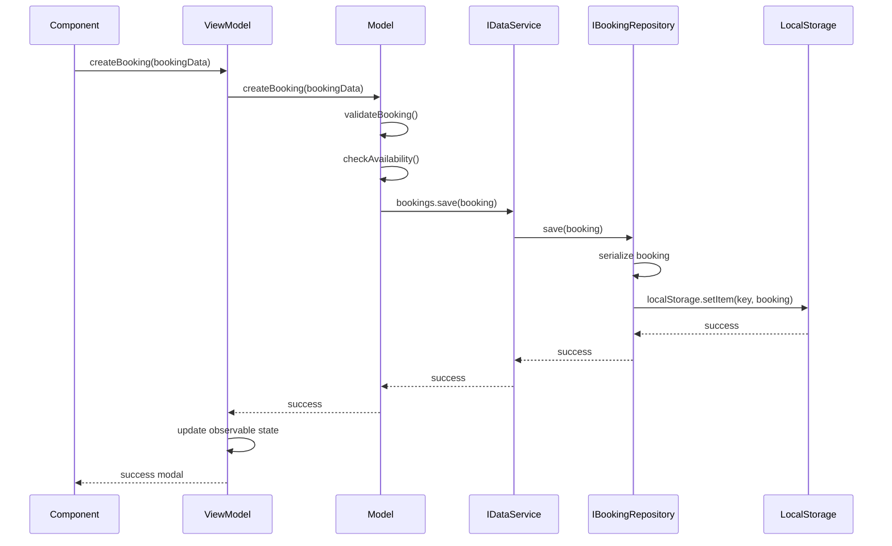
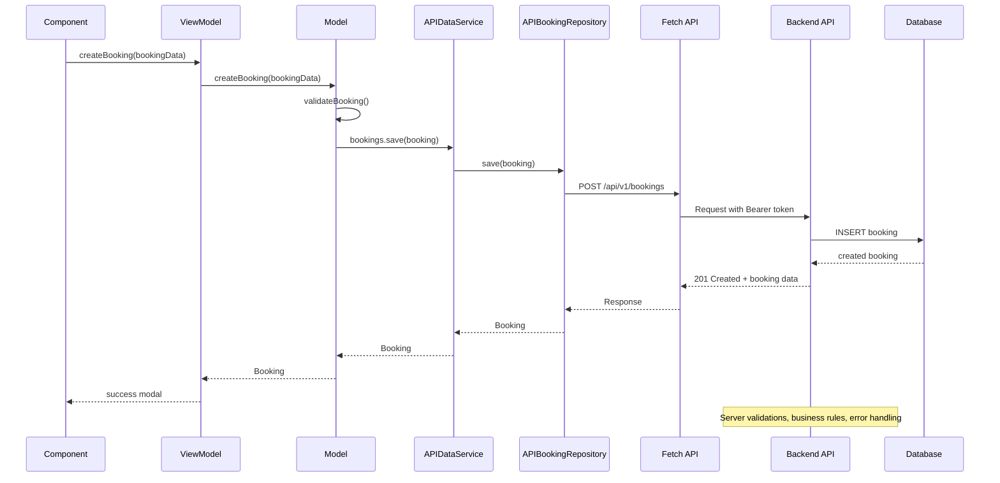

# Arquitectura Completa de Nivel UI - Integración con Backend

## 🏗️ Visión General

El sistema implementa una arquitectura **MVVM + Repositories** que abstrae completamente el acceso a datos, permitiendo cambiar la fuente de datos (LocalStorage, API REST, GraphQL, etc.) sin afectar el resto de la aplicación.

## 📊 Diagrama de Arquitectura General



## 🔍 Diagrama de Clases - Capa de Repositorios

```mermaid
classDiagram
    class IDataService {
        <<interface>>
        +trainers: ITrainerRepository
        +bookings: IBookingRepository
        +initialize() Promise~void~
        +clear() Promise~void~
    }
    
    class ITrainerRepository {
        <<interface>>
        +getAll() Promise~Trainer[]~
        +getById(id: string) Promise~Trainer | null~
        +save(trainer: Trainer) Promise~void~
        +saveSchedule(schedule: TrainerSchedule) Promise~void~
        +getSchedule(trainerId: string) Promise~TrainerSchedule | null~
    }
    
    class IBookingRepository {
        <<interface>>
        +getAll() Promise~Booking[]~
        +getById(id: string) Promise~Booking | null~
        +getByDate(date: Date) Promise~Booking[]~
        +getByTrainer(trainerId: string) Promise~Booking[]~
        +save(booking: Booking) Promise~void~
        +update(id: string, booking: Partial~Booking~) Promise~void~
        +delete(id: string) Promise~void~
    }
    
    class IProgramRepository {
        <<interface>>
        +getAll() Promise~Program[]~
        +getById(id: string) Promise~Program | null~
        +getByClient(clientId: string) Promise~Program[]~
        +save(program: Program) Promise~void~
        +update(id: string, program: Partial~Program~) Promise~void~
        +delete(id: string) Promise~void~
    }
    
    class LocalStorageDataService {
        -trainers: ITrainerRepository
        -bookings: IBookingRepository
        +constructor()
        +initialize() Promise~void~
        +clear() Promise~void~
    }
    
    class LocalStorageTrainerRepository {
        -key: string
        +getAll() Promise~Trainer[]~
        +getById(id: string) Promise~Trainer | null~
        +save(trainer: Trainer) Promise~void~
        +saveSchedule(schedule: TrainerSchedule) Promise~void~
        +getSchedule(trainerId: string) Promise~TrainerSchedule | null~
        -parseData(data: string): Trainer[]
    }
    
    class LocalStorageBookingRepository {
        -key: string
        +getAll() Promise~Booking[]~
        +getById(id: string) Promise~Booking | null~
        +getByDate(date: Date) Promise~Booking[]~
        +getByTrainer(trainerId: string) Promise~Booking[]~
        +save(booking: Booking) Promise~void~
        +update(id: string, booking: Partial~Booking~) Promise~void~
        +delete(id: string) Promise~void~
        -parseBookings(data: string): Booking[]
        -initializeData() Promise~void~
    }
    
    class APIDataService {
        -trainers: ITrainerRepository
        -bookings: IBookingRepository
        -baseUrl: string
        -tokenProvider: Function
        +constructor(tokenProvider: Function)
        +initialize() Promise~void~
        +clear() Promise~void~
        -authenticatedRequest(url: string, options: RequestInit) Promise~Response~
    }
    
    class APITrainerRepository {
        -baseUrl: string
        -tokenProvider: Function
        +constructor(baseUrl: string, tokenProvider: Function)
        +getAll() Promise~Trainer[]~
        +getById(id: string) Promise~Trainer | null~
        +save(trainer: Trainer) Promise~void~
        +saveSchedule(schedule: TrainerSchedule) Promise~void~
        +getSchedule(trainerId: string) Promise~TrainerSchedule | null~
        -handleError(response: Response): Promise~never~
    }
    
    class APIBookingRepository {
        -baseUrl: string
        -tokenProvider: Function
        +constructor(baseUrl: string, tokenProvider: Function)
        +getAll() Promise~Booking[]~
        +getById(id: string) Promise~Booking | null~
        +getByDate(date: Date) Promise~Booking[]~
        +getByTrainer(trainerId: string) Promise~Booking[]~
        +save(booking: Booking) Promise~void~
        +update(id: string, booking: Partial~Booking~) Promise~void~
        +delete(id: string) Promise~void~
        -handleError(response: Response): Promise~never~
    }
    
    IDataService <|-- LocalStorageDataService
    IDataService <|-- APIDataService
    ITrainerRepository <|-- LocalStorageTrainerRepository
    ITrainerRepository <|-- APITrainerRepository
    IBookingRepository <|-- LocalStorageBookingRepository
    IBookingRepository <|-- APIBookingRepository
    
    IDataService --> ITrainerRepository
    IDataService --> IBookingRepository
    
    LocalStorageDataService --> LocalStorageTrainerRepository
    LocalStorageDataService --> LocalStorageBookingRepository
    APIDataService --> APITrainerRepository
    APIDataService --> APIBookingRepository
```



## 🔄 Diagrama de Secuencia - Flujo de Comunicación

### 1. Flujo de Lectura de Datos (Trainers)



### 2. Flujo de Escritura de Datos (Booking)



### 3. Flujo con Backend API (Futuro)



## 🏛️ Explicación de Interfaces y Clases

### Interfaz Principal: `IDataService`

```typescript
export interface IDataService {
  trainers: ITrainerRepository;
  bookings: IBookingRepository;
  initialize(): Promise<void>;
  clear(): Promise<void>;
}
```

**Propósito**: Punto de entrada único para todas las operaciones de datos.

**Responsabilidades**:
- Orquestar los diferentes repositorios
- Inicializar el sistema de almacenamiento
- Proveer métodos de limpieza/mantenimiento

### Interfaz Específica: `ITrainerRepository`

```typescript
export interface ITrainerRepository {
  getAll(): Promise<Trainer[]>;
  getById(id: string): Promise<Trainer | null>;
  save(trainer: Trainer): Promise<void>;
  saveSchedule(schedule: TrainerSchedule): Promise<void>;
  getSchedule(trainerId: string): Promise<TrainerSchedule | null>;
}
```

**Propósito**: Abstracción para operaciones CRUD de entrenadores.

**Principio de Diseño**: Cada repositorio maneja un único tipo de entidad.

### Implementación Actual: `LocalStorageTrainerRepository`

```typescript
class LocalStorageTrainerRepository implements ITrainerRepository {
  private readonly key = 'nivel-trainers';

  async getAll(): Promise<Trainer[]> {
    const data = localStorage.getItem(this.key);
    return data ? JSON.parse(data) : initialData.trainers;
  }

  async save(trainer: Trainer): Promise<void> {
    const trainers = await this.getAll();
    const index = trainers.findIndex(t => t.id === trainer.id);
    
    if (index >= 0) {
      trainers[index] = trainer; // Update
    } else {
      trainers.push(trainer); // Create
    }
    
    localStorage.setItem(this.key, JSON.stringify(trainers));
  }
}
```

**Características**:
- Persistencia en localStorage del navegador
- Datos serializados como JSON
- Datos de demo inicial para development
- Manejo de fechas y tipos complejos

## 🚀 Migración a Backend - Implementación Propuesta

### 1. Nueva Implementación: `APIDataService`

```typescript
export class APIDataService implements IDataService {
  trainers: ITrainerRepository;
  bookings: IBookingRepository;
  private baseUrl: string;
  private tokenProvider: () => string;

  constructor(baseUrl: string, tokenProvider: () => string) {
    this.baseUrl = baseUrl;
    this.tokenProvider = tokenProvider;
    this.trainers = new APITrainerRepository(baseUrl, tokenProvider);
    this.bookings = new APIBookingRepository(baseUrl, tokenProvider);
  }

  async initialize(): Promise<void> {
    // Verificar conexión y autenticación
    const response = await this.authenticatedRequest(`${this.baseUrl}/health`);
    if (!response.ok) {
      throw new Error('No se puede conectar al backend');
    }
  }

  private async authenticatedRequest(url: string, options: RequestInit = {}) {
    const token = this.tokenProvider();
    
    return fetch(url, {
      ...options,
      headers: {
        ...options.headers,
        'Authorization': `Bearer ${token}`,
        'Content-Type': 'application/json'
      }
    });
  }
}
```

### 2. Implementación de Repositorio API

```typescript
class APIBookingRepository implements IBookingRepository {
  constructor(
    private baseUrl: string,
    private tokenProvider: () => string
  ) {}

  async getAll(): Promise<Booking[]> {
    const response = await this.authenticatedRequest(`${this.baseUrl}/bookings`);
    if (!response.ok) {
      await this.handleError(response);
    }
    const data = await response.json();
    return data.map(this.parseBooking);
  }

  async save(booking: Booking): Promise<void> {
    const response = await this.authenticatedRequest(`${this.baseUrl}/bookings`, {
      method: 'POST',
      body: JSON.stringify(booking)
    });

    if (!response.ok) {
      await this.handleError(response);
    }
  }

  async getByDate(date: Date): Promise<Booking[]> {
    const dateStr = date.toISOString().split('T')[0];
    const response = await this.authenticatedRequest(
      `${this.baseUrl}/bookings?date=${dateStr}`
    );
    
    if (!response.ok) {
      await this.handleError(response);
    }
    
    const data = await response.json();
    return data.map(this.parseBooking);
  }

  private async handleError(response: Response): Promise<never> {
    const error = await response.json().catch(() => ({}));
    
    if (response.status === 409) {
      // Conflict - capacidad excedida
      throw new BookingCapacityError(
        error.zone,
        error.current,
        error.max
      );
    }
    
    if (response.status === 401) {
      throw new Error('Sesión expirada. Inicia sesión nuevamente.');
    }
    
    throw new Error(error.message || 'Error en la operación');
  }

  private parseBooking(data: any): Booking {
    return {
      ...data,
      date: new Date(data.date)
    };
  }

  private async authenticatedRequest(url: string, options: RequestInit = {}) {
    const token = this.tokenProvider();
    
    return fetch(url, {
      ...options,
      headers: {
        ...options.headers,
        'Authorization': `Bearer ${token}`,
        'Content-Type': 'application/json'
      }
    });
  }
}
```

## 📋 Endpoints Esperados del Backend API

### Entidad: Trainers
```
GET    /api/v1/trainers           // Listar todos los entrenadores
GET    /api/v1/trainers/:id       // Obtener entrenador específico
POST   /api/v1/trainers           // Crear nuevo entrenador
PUT    /api/v1/trainers/:id       // Actualizar entrenador
DELETE /api/v1/trainers/:id       // Eliminar entrenador

GET    /api/v1/trainers/:id/schedule    // Obtener horario del entrenador
PUT    /api/v1/trainers/:id/schedule    // Actualizar horario del entrenador
```

### Entidad: Bookings
```
GET    /api/v1/bookings           // Listar todas las reservas
GET    /api/v1/bookings/:id       // Obtener reserva específica
GET    /api/v1/bookings?date=...  // Filtrar por fecha
GET    /api/v1/bookings?trainer=... // Filtrar por entrenador
GET    /api/v1/bookings?client=...  // Filtrar por cliente
POST   /api/v1/bookings           // Crear nueva reserva
PUT    /api/v1/bookings/:id       // Actualizar reserva
DELETE /api/v1/bookings/:id       // Cancelar/eliminar reserva
```

### Entidad: Programs
```
GET    /api/v1/programs           // Listar todos los programas
GET    /api/v1/programs/:id       // Obtener programa específico
GET    /api/v1/programs?client=...  // Programas de un cliente
POST   /api/v1/programs           // Crear nuevo programa
PUT    /api/v1/programs/:id       // Actualizar programa
DELETE /api/v1/programs/:id       // Eliminar programa
```

## 🔧 Integración con Backend - Cambio Mínimo

### Paso 1: Implementar Nuevas Clases API

```typescript
// src/core/repositories/api.ts
export class APIDataService implements IDataService {
  // ... implementación mostrada anteriormente
}

export class APITrainerRepository implements ITrainerRepository {
  // ... implementación mostrada anteriormente
}

export class APIBookingRepository implements IBookingRepository {
  // ... implementación mostrada anteriormente
}
```

### Paso 2: Modificar DataProvider

```typescript
// src/core/providers/DataProvider.tsx
import { LocalStorageDataService } from '../repositories/localStorage';
import { APIDataService } from '../repositories/api';

// Función para obtener token de autenticación
function getAuthToken(): string {
  return localStorage.getItem('auth-token') || '';
}

export function DataProvider({ children }: DataProviderProps) {
  // CAMBIO ÚNICO: Cambiar la implementación
  const [service] = useState<IDataService>(() => 
    // ANTES: new LocalStorageDataService()
    // AHORA: new APIDataService('/api/v1', getAuthToken)
    new APIDataService('/api/v1', getAuthToken)
  );

  if (isServiceLoading) {
    return <div>Loading...</div>;
  }

  return (
    <ViewModelContext.Provider value={createViewModels(service)}>
      {children}
    </ViewModelContext.Provider>
  );
}
```

### Paso 3: Configurar Environment Variables

```typescript
// src/config/environment.ts
export const config = {
  apiUrl: process.env.NEXT_PUBLIC_API_URL || 'http://localhost:3001/api/v1',
  isDevelopment: process.env.NODE_ENV === 'development'
};
```

```typescript
// DataProvider.tsx con configuración
const [service] = useState<IDataService>(() => 
  new APIDataService(config.apiUrl, getAuthToken)
);
```

## 🛡️ Estrategias de Manejo de Errores

### 1. Errores de Conexión

```typescript
class APIDataService implements IDataService {
  async initialize(): Promise<void> {
    try {
      const response = await fetch(`${this.baseUrl}/health`);
      if (!response.ok) {
        throw new Error('Backend no disponible');
      }
    } catch (error) {
      // Fallback a localStorage como backup
      console.warn('Backend no disponible, usando localStorage');
      return new LocalStorageDataService();
    }
  }
}
```

### 2. Manejo de Errores Específicos

```typescript
class APIBookingRepository implements IBookingRepository {
  private async handleError(response: Response): Promise<never> {
    const error = await response.json().catch(() => ({}));
    
    switch (response.status) {
      case 401:
        throw new AuthenticationError('Sesión expirada');
      case 403:
        throw new AuthorizationError('No tienes permisos');
      case 409:
        throw new BookingCapacityError(error.zone, error.current, error.max);
      case 422:
        throw new ValidationError(error.details);
      default:
        throw new Error(error.message || 'Error desconocido');
    }
  }
}
```

## 🎯 Ventajas de esta Arquitectura

### 1. **Cambio Cero en Lógica de Negocio**
- ViewModels no cambian
- Models no cambian  
- Componentes no cambian
- Solo cambiar implementación del repositorio

### 2. **Testing Simplificado**
```typescript
// Test con localStorage
const localService = new LocalStorageDataService();
const bookingModel = new BookingModel(localService);

// Test con mock API
const mockService = new MockDataService();
const bookingModel = new BookingModel(mockService);
```

### 3. **Migración Gradual**
```typescript
// Migración por entidad
class HybridDataService implements IDataService {
  trainers = new APITrainerRepository();     // Ya en backend
  bookings = new LocalStorageBookingRepository(); // Aún local
}
```

### 4. **Offline First (Futuro)**
```typescript
class OfflineFirstRepository implements IBookingRepository {
  constructor(private apiRepo: APIBookingRepository, private localRepo: LocalStorageBookingRepository) {}
  
  async save(booking: Booking): Promise<void> {
    try {
      await this.apiRepo.save(booking);
      await this.localRepo.save(booking); // Cache local
    } catch (error) {
      await this.localRepo.save(booking); // Guardar localmente
      // Enqueue para sync cuando vuelva la conexión
    }
  }
}
```

## 📊 Resumen de la Arquitectura

```
┌─────────────────────────────────────────────────────────────────┐
│                     ARQUITECTURA MVVM + REPOSITORIOS           │
├─────────────────────────────────────────────────────────────────┤
│  Components React ──► ViewModels (MobX) ──► Models            │
│                      ▲                       │                 │
│                      │                       ▼                 │
│                       └────◄── IDataService ◄──┘                 │
│                                │                               │
│           ┌────────────────────┼────────────────────┐          │
│           ▼                    ▼                    ▼          │
│    ITrainerRepository   IBookingRepository   IProgramRepository │
│           │                    │                    │          │
│   ┌───────┴───────┐    ┌───────┴───────┐    ┌───────┴───────┐  │
│   │ LocalStorage  │    │ LocalStorage  │    │ LocalStorage  │  │
│   │   Repository  │    │   Repository  │    │   Repository  │  │
│   └───────────────┘    └───────────────┘    └───────────────┘  │
│                                                                   │
│   ┌───────┴───────┐    ┌───────┴───────┐    ┌───────┴───────┐  │
│   │  API          │    │  API          │    │  API          │  │
│   │ Repository    │    │ Repository    │    │ Repository    │  │
│   └───────────────┘    └───────────────┘    └───────────────┘  │
└─────────────────────────────────────────────────────────────────┘
```

## 🚀 Conclusión

La arquitectura de repositorios de Nivel UI está **diseñada para ser agnóstica a la fuente de datos**, lo que permite:

1. **Migración instantánea a backend** con solo cambiar una línea de código
2. **Testing robusto** con mocks y diferentes implementaciones  
3. **Escalabilidad** para añadir nuevas fuentes de datos (GraphQL, WebSockets, etc.)
4. **Offline support** futuro con patrones de sincronización
5. **Separación total** entre UI y persistencia de datos

El diseño sigue principios SOLID y Clean Architecture, garantizando que el sistema sea mantenible, testeable y adaptable a futuros requerimientos.

## 🔍 Flujo de Datos Actual vs Backend

### Actual (LocalStorage)
```
Usuario → Componente → ViewModel → Model → LocalStorageDataService → LocalStorage
```

### Futuro (Backend API)
```
Usuario → Componente → ViewModel → Model → APIDataService → HTTP → Backend API → Database
```

**El cambio solo afecta la capa de datos, toda la lógica de presentación y negocio permanece idéntica.**