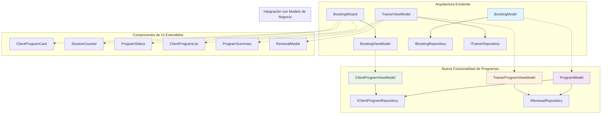

# Diagrama de Integración de Componentes - Programa de Clientes

## Visión General

Este documento analiza cómo se integra la nueva funcionalidad de programas de clientes con la arquitectura existente e identifica los componentes que serían reemplazados, modificados o mantenidos.

## Arquitectura Actual vs Nueva Arquitectura

### Arquitectura Actual Simplificada
```
┌─────────────────────────────────────────────────────────────────┐
│                    PRESENTATION LAYER                          │
├─────────────────┬─────────────────┬─────────────────────────────┤
│   Client Flow   │  Trainer Flow   │      Shared Components      │
│                 │                 │                             │
│ BookingWizard   │ TrainerSchedule │    ConfirmationModal        │
│ CalendarStep    │ TrainerAppointments │   SuccessModal           │
│ TimeGridStep    │ SaveScheduleModal │   BookingView            │
│                 │                 │                             │
└─────────────────┴─────────────────┴─────────────────────────────┘
                                │
┌─────────────────────────────────────────────────────────────────┐
│                   VIEWMODEL LAYER                              │
├─────────────────┬─────────────────┬─────────────────────────────┤
│ BookingViewModel│ TrainerViewModel│      (No existing)          │
│ (Client State)  │ (Trainer State) │                             │
│                 │                 │                             │
└─────────────────┴─────────────────┴─────────────────────────────┘
                                │
┌─────────────────────────────────────────────────────────────────┐
│                     MODEL LAYER                                │
├─────────────────────────────────────────────────────────────────┤
│                   BookingModel                                  │
│              (Business Logic Unified)                           │
│                 │                                               │
└─────────────────┴───────────────────────────────────────────────┘
                                │
┌─────────────────────────────────────────────────────────────────┐
│                 REPOSITORY LAYER                               │
├─────────────────┬─────────────────┬─────────────────────────────┤
│ ITrainerRepo    │ IBookingRepo   │      (No existing)          │
│                 │                 │                             │
└─────────────────┴─────────────────┴─────────────────────────────┘
```

### Nueva Arquitectura con Programas de Clientes
```
┌─────────────────────────────────────────────────────────────────┐
│                    PRESENTATION LAYER                          │
├─────────────────┬─────────────────┬─────────────────────────────┤
│   Client Flow   │  Trainer Flow   │      Program Components     │
│                 │                 │                             │
│ BookingWizard   │ TrainerSchedule │   ClientProgramCard         │
│ CalendarStep    │ TrainerAppointments │   SessionCounter        │
│ TimeGridStep    │ SaveScheduleModal │   ProgramStatus          │
│ ClientProgramCard│ ProgramSummary │   RenewalModal             │
│ SessionCounter  │ RenewalModal   │   ClientProgramList        │
│                 │ ProgramAnalytics│                             │
└─────────────────┴─────────────────┴─────────────────────────────┘
                                │
┌─────────────────────────────────────────────────────────────────┐
│                   VIEWMODEL LAYER                              │
├─────────────────┬─────────────────┬─────────────────────────────┤
│ BookingViewModel│ TrainerViewModel│   ClientProgramViewModel     │
│ (Enhanced)      │ (Enhanced)      │   TrainerProgramViewModel   │
│                 │                 │                             │
└─────────────────┴─────────────────┴─────────────────────────────┘
                                │
┌─────────────────────────────────────────────────────────────────┐
│                     MODEL LAYER                                │
├─────────────────────────────────────────────────────────────────┤
│                   BookingModel                                  │
│              (Enhanced with Program Logic)                      │
│                 │                                               │
│           ProgramModel (NEW)                                    │
│                 │                                               │
└─────────────────┴───────────────────────────────────────────────┘
                                │
┌─────────────────────────────────────────────────────────────────┐
│                 REPOSITORY LAYER                               │
├─────────────────┬─────────────────┬─────────────────────────────┤
│ ITrainerRepo    │ IBookingRepo    │   IClientProgramRepo        │
│                 │                 │   IRenewalRepo              │
└─────────────────┴─────────────────┴─────────────────────────────┘
```

## Análisis de Componentes

### 1. Componentes MANTENIDOS (Sin cambios)

#### 1.1. Shared Components
- **ConfirmationModal.tsx** ✅ *Mantenido sin cambios*
- **SuccessModal.tsx** ✅ *Mantenido sin cambios*
- **BookingView.tsx** ✅ *Mantenido sin cambios*

#### 1.2. Base Architecture
- **ARCHITECTURE.md** ✅ *Mantenido como referencia*
- **DataProvider.tsx** ✅ *Extendido pero no reemplazado*
- **ViewModelProvider.tsx** ✅ *Extendido pero no reemplazado*

### 2. Componentes MODIFICADOS (Enhancements)

#### 2.1. Client Flow Components
- **BookingWizard.tsx** 🔄 *Modificado*
  - **Cambio**: Añadir validación de sesiones disponibles
  - **Integración**: Con ClientProgramViewModel
  - **Impacto**: Bajo - solo adds session validation

- **CalendarStep.tsx** 🔄 *Modificado*
  - **Cambio**: Mostrar indicador de sesiones restantes
  - **Integración**: Con ClientProgramViewModel
  - **Impacto**: Bajo - visual enhancement

- **TimeGridStep.tsx** 🔄 *Modificado*
  - **Cambio**: Deshabilitar horarios si no hay sesiones
  - **Integración**: Validación con program availability
  - **Impacto**: Medio - affects booking availability logic

#### 2.2. Trainer Flow Components
- **TrainerAppointments.tsx** 🔄 *Modificado*
  - **Cambio**: Mostrar información del programa del cliente
  - **Integración】： Con TrainerProgramViewModel
  - **Impacto**: Medio - adds program summary display

- **TrainerSchedule.tsx** 🔄 *Modificado*
  - **Cambio**: Contexto del programa al ver citas
  - **Integración**: Con program data
  - **Impacto**: Bajo - contextual information

#### 2.3. ViewModel Layer
- **BookingViewModel.tsx** 🔄 *Modificado*
  - **Cambio**: Añadir validación de sesiones del programa
  - **Integración**: Con ClientProgramModel
  - **Impacto**: Medio - core booking logic enhancement

- **TrainerViewModel.tsx** 🔄 *Modificado*
  - **Cambio**: Añadir métodos para gestión de programas
  - **Integración**: Con ProgramModel
  - **Impacto**: Medio - trainer capabilities expansion

#### 2.4. Model Layer
- **BookingModel.ts** 🔄 *Modificado*
  - **Cambio**: Añadir métodos de validación y descuento de sesiones
  - **Integración**: Con program repositories
  - **Impacto**: Alto - core business logic enhancement

#### 2.5. Types Layer
- **index.ts** 🔄 *Modificado*
  - **Cambio**: Añadir tipos de programa y renovación
  - **Integración**: Extend existing interfaces
  - **Impacto**: Bajo - type definitions

### 3. Componentes NUEVOS (New Additions)

#### 3.1. Client Program Components
```typescript
// NEW: ClientProgramCard.tsx
interface ClientProgramCardProps {
  program: ClientProgram;
  onViewDetails?: () => void;
}

// NEW: SessionCounter.tsx
interface SessionCounterProps {
  remainingSessions: number;
  totalSessions: number;
  status: ProgramStatus;
}

// NEW: ProgramStatus.tsx
interface ProgramStatusProps {
  status: ProgramStatus;
  expirationDate?: Date;
  daysUntilExpiration?: number;
}
```

#### 3.2. Trainer Program Components
```typescript
// NEW: ClientProgramList.tsx
interface ClientProgramListProps {
  trainerId: string;
  onSelectClient: (clientId: string) => void;
}

// NEW: ProgramSummary.tsx
interface ProgramSummaryProps {
  clientId: string;
  program: ClientProgram;
  onRenew?: () => void;
  onSuspend?: () => void;
}

// NEW: RenewalModal.tsx
interface RenewalModalProps {
  program: ClientProgram;
  isOpen: boolean;
  onClose: () => void;
  onRenew: (renewalData: RenewalData) => void;
}

// NEW: ProgramAnalytics.tsx
interface ProgramAnalyticsProps {
  trainerId: string;
  dateRange?: { start: Date; end: Date };
}
```

#### 3.3. New ViewModels
```typescript
// NEW: ClientProgramViewModel.ts
class ClientProgramViewModel {
  @observable myProgram: ClientProgram | null = null;
  @observable remainingSessions: number = 0;
  @observable programStatus: ProgramStatus = 'active';
  
  // Program management methods
}

// NEW: TrainerProgramViewModel.ts
class TrainerProgramViewModel {
  @observable clientPrograms: ClientProgram[] = [];
  @observable selectedClient: Client | null = null;
  
  // Trainer program management methods
}
```

#### 3.4. New Model
```typescript
// NEW: ProgramModel.ts
class ProgramModel {
  // Program-specific business logic
  async createProgram(programData: Omit<ClientProgram, 'id'>): Promise<ClientProgram>
  async renewProgram(programId: string, renewalData: RenewalData): Promise<ClientProgram>
  async validateProgramConstraints(program: ClientProgram): Promise<boolean>
}
```

#### 3.5. New Repositories
```typescript
// NEW: IClientProgramRepository.ts
interface IClientProgramRepository {
  // Program data access methods
}

// NEW: IRenewalRepository.ts
interface IRenewalRepository {
  // Renewal data access methods
}
```

### 4. Componentes DEPRECADOS (To be Replaced)

#### 4.1. Ningún componente completamente deprecado
- **Resultado**: Todos los componentes existentes se mantienen con modificaciones incrementales
- **Ventaja**: Migración gradual sin breaking changes
- **Estrategia**: Enhance & Extend approach

## Flujo de Datos Actualizado

### Flujo de Reserva con Programa
```
Client selects date/time
        ↓
BookingWizard (enhanced) validates program sessions
        ↓
ClientProgramViewModel.checkSessionAvailability()
        ↓
ProgramModel.validateSessionAvailability()
        ↓
BookingModel.createBooking() (enhanced)
        ↓
ProgramModel.deductSessionFromProgram()
        ↓
UI Updates: SessionCounter, ProgramStatus
```

### Flujo de Gestión de Programas (Entrenador)
```
Trainer views client list
        ↓
TrainerProgramViewModel.getClientPrograms()
        ↓
ClientProgramList displays programs
        ↓
Trainer selects client → ProgramSummary
        ↓
RenewalModal if needed
        ↓
ProgramModel.renewProgram()
        ↓
UI Updates: All client program displays
```

## Impacto en la Arquitectura MVVM

### 1. Presentation Layer Impact
- **Impacto**: MEDIO
- **Cambios**: 6 componentes modificados, 8 componentes nuevos
- **Mantenibilidad**: Alta - componentes cohesivos y reutilizables

### 2. ViewModel Layer Impact
- **Impacto**: MEDIO  
- **Cambios**: 2 ViewModels modificados, 2 ViewModels nuevos
- **Ventaja**: Separación clara de responsabilidades mantenida

### 3. Model Layer Impact
- **Impacto**: ALTO
- **Cambios**: 1 Model modificado, 1 Model nuevo
- **Resultado**: Lógica de negocio bien estructurada y escalable

### 4. Repository Layer Impact
- **Impacto**: BAJO
- **Cambios**: 2 nuevos repositories
- **Beneficio**: Persistencia desacoplada y extensible

## Estrategia de Migración Recomendada

### Fase 1: Foundation (Week 1-2)
1. **Crear nuevos tipos y repositorios**
   - Definir interfaces de programs y renewals
   - Implementar repositorios base en localStorage
   - Extender IDataService

2. **Implementar ProgramModel**
   - Lógica de negocio de programas
   - Validaciones y reglas de renovación

### Fase 2: Integration (Week 3-4)
1. **Modificar BookingModel**
   - Añadir validación de sesiones
   - Integrar descuento automático

2. **Actualizar ViewModels existentes**
   - BookingViewModel con lógica de programas
   - TrainerViewModel con capacidades extendidas

### Fase 3: UI Components (Week 5-6)
1. **Crear componentes de programas**
   - ClientProgramCard, SessionCounter, ProgramStatus
   - Componentes para entrenadores

2. **Modificar componentes existentes**
   - Integrar validación en BookingWizard
   - Añadir contexto en TrainerAppointments

### Fase 4: Advanced Features (Week 7-8)
1. **Implementar renovaciones automáticas**
   - Detección de programas por expirar
   - Notificaciones y alertas

2. **Analytics y reportes**
   - ProgramAnalytics component
   - Estadísticas de uso de programas

## Consideraciones Técnicas

### 1. Backward Compatibility
- **Reservas existentes**: Mantener compatibilidad con bookings sin programa
- **Migración gradual**: Permitir coexistencia de ambos sistemas
- **Data migration**: Scripts para migrar datos si es necesario

### 2. Performance Considerations
- **Caching**: Implementar cache de programas activos
- **Lazy loading**: Cargar datos de programas bajo demanda
- **Optimistic updates**: Actualizar UI inmediatamente con validación posterior

### 3. Error Handling
- **Errores de dominio**: Nuevos tipos específicos para programas
- **Validación previa**: Validar restricciones antes de operaciones
- **Rollback**: Capacidad de revertir cambios en caso de error

## Resumen de Impacto

| Categoría | Componentes Totales | Mantenidos | Modificados | Nuevos | Deprecados |
|-----------|-------------------|------------|-------------|---------|------------|
| **Presentation** | 11 | 3 | 6 | 8 | 0 |
| **ViewModels** | 4 | 0 | 2 | 2 | 0 |
| **Models** | 2 | 0 | 1 | 1 | 0 |
| **Repositories** | 4 | 2 | 0 | 2 | 0 |
| **Types/Interfaces** | Multiple | 0 | 1 | Multiple | 0 |

### Conclusión del Análisis

**Total de Cambios**: 19 componentes afectados
- **0% deprecados** - Ningún componente existente se elimina completamente
- **42% modificados** - Cambios incrementales en componentes existentes  
- **58% nuevas adiciones** - Componentes completamente nuevos para funcionalidad de programas

**Ventajas Clave**:
1. **Migración Gradual**: Sin breaking changes, el sistema actual sigue funcionando
2. **Arquitectura Limpia**: Se mantiene el patrón MVVM y principios SOLID
3. **Escalabilidad**: Los nuevos componentes son modulares y reutilizables
4. **Compatibilidad**: Coexistencia de reservas con y sin programa

**Riesgos Minimizados**:
- Bajo riesgo de regressión al mantener componentes existentes
- Testing incremental posible por fases
- Rollback fácil si algún componente nuevo causa problemas

## Diagrama Visual de Integración



## Recomendaciones Finales

1. **Implementación por Fases**: Seguir la estrategia de 4 fases propuesta
2. **Testing Automatizado**: Crear tests unitarios para nuevos ViewModels y Models
3. **Documentación**: Mantener actualizada la documentación de arquitectura
4. **Monitorización**: Implementar logging para trackear operaciones de programas
5. **Feedback de Usuarios**: Recoger feedback de clientes y entrenadores después de cada fase

Este enfoque garantiza una integración exitosa de la funcionalidad de programas de clientes manteniendo la estabilidad y escalabilidad del sistema existente.
