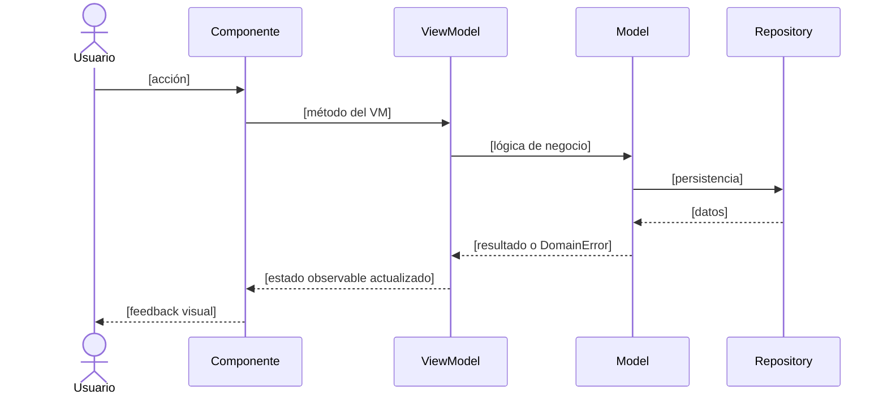

# Feature: [Nombre de la Feature]

## Contexto

[Describe el problema que resuelve esta feature y por qué es necesaria. Incluye referencias al issue de GitHub.]

**Issue**: [#NNN](https://github.com/rcastillejo/nivel-ui/issues/NNN)

## Roles Involucrados

- **Cliente**: Usuario que reserva sesiones en el gimnasio
- **Entrenador**: Personal del gimnasio que gestiona disponibilidad
- **Sistema**: La aplicación nivel-ui

## Casos de Uso (Gherkin)

### Escenario 1: [Happy Path — descripción breve]

```gherkin
Feature: [Nombre de la Feature]
  As a [rol del usuario]
  I want [qué quiere hacer]
  So that [beneficio que obtiene]

  Scenario: [Nombre del escenario exitoso]
    Given [precondición]
    When [acción del usuario]
    Then [resultado esperado]
    And [condición adicional]
```

### Escenario 2: [Error Path — descripción breve]

```gherkin
  Scenario: [Nombre del escenario de error]
    Given [precondición]
    When [acción que genera error]
    Then [mensaje de error esperado]
```

## Contratos TypeScript

> Interfaces que deben existir para implementar esta feature. Estos contratos viven en `src/core/types/`.

```typescript
// Tipos de dominio nuevos o modificados
export interface [NuevoTipo] {
  id: string;
  // ...campos
}

// Errores de dominio nuevos (en src/core/types/errors.ts)
export class [NombreError] extends Error {
  constructor(/* parámetros */) {
    super('[mensaje]');
    this.name = '[NombreError]';
  }
}
```

## Criterios de Aceptación

> Los tests unitarios, de integración y E2E verifican estos criterios.
> **Si todos los tests pasan → spec cumplida.**

### Funcionales
- [ ] [Criterio 1: qué debe poder hacer el usuario]
- [ ] [Criterio 2]
- [ ] [Criterio 3]

### No Funcionales
- [ ] [Criterio de accesibilidad: todos los elementos interactivos tienen `data-testid`]
- [ ] [Criterio de performance, si aplica]

### Tests Requeridos
- [ ] Test unitario: `tests/unit/core/models/[Model].test.ts`
- [ ] Test de integración: `tests/integration/[Flow].integration.test.ts`
- [ ] Test E2E: `e2e/[flow].spec.ts`

## Diagrama de Flujo



## ADRs Relacionados

- Ninguno *(agregar links a `docs/adr/` si hay decisiones arquitectónicas asociadas)*

## Notas de Implementación

> Solo completar cuando ya existe la implementación.

- **Model**: `src/core/models/[Model].ts`
- **ViewModel**: `src/core/view-models/[ViewModel].ts`
- **Componentes**: `src/components/[Component].tsx`
- **Tests unitarios**: `tests/unit/core/models/[Model].test.ts`
- **Tests E2E**: `e2e/[flow].spec.ts`
