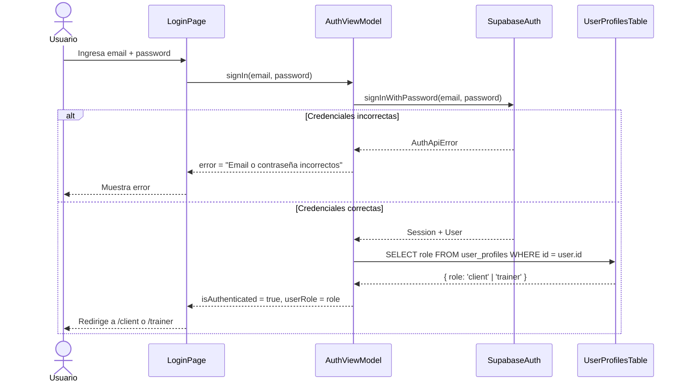

# Feature: Autenticación de Usuarios con Supabase Auth

## Contexto

Para que los datos de reservas sean compartidos entre clientes y entrenadores, cada usuario
debe estar autenticado. Supabase Auth provee un sistema de autenticación listo para usar que
se integra directamente con el Row Level Security (RLS) de PostgreSQL.

Esta feature agrega una pantalla de login y registra el rol del usuario (`client` | `trainer`)
en la tabla `user_profiles` para que el sistema pueda determinar qué vista y qué datos mostrar.

**Prerequisito**: `supabase-schema.spec.md` y `supabase-data-service.spec.md` implementadas.
**ADR relacionado**: [ADR-002: Estrategia de Despliegue a Producción MVP](../adr/ADR-002-produccion-mvp-deployment.md)

## Roles Involucrados

- **Cliente**: Se autentica para ver y crear sus reservas
- **Entrenador**: Se autentica para ver todas las reservas y gestionar su disponibilidad
- **Sistema**: Redirige al usuario a la vista correcta según su rol tras el login

## Casos de Uso (Gherkin)

### Escenario 1: Cliente inicia sesión y es redirigido a su panel

```gherkin
Feature: Autenticación de usuarios
  As a usuario del gimnasio
  I want poder iniciar sesión con mi email
  So that puedo acceder a mis datos de forma segura desde cualquier dispositivo

  Scenario: Cliente inicia sesión exitosamente
    Given el usuario "alice@gym.com" existe con rol "client"
    When alice ingresa su email y contraseña correctos en la pantalla de login
    And hace clic en "Iniciar sesión"
    Then el sistema autentica a alice con Supabase Auth
    And la redirige a "/client" (panel de reservas del cliente)
    And el header muestra el nombre de alice
```

### Escenario 2: Entrenador inicia sesión y es redirigido a su panel

```gherkin
  Scenario: Entrenador inicia sesión exitosamente
    Given el usuario "carlos@gym.com" existe con rol "trainer"
    When carlos ingresa sus credenciales correctas
    Then el sistema lo redirige a "/trainer" (panel del entrenador)
    And carlos puede ver todas las reservas de todos los clientes
```

### Escenario 3: Login fallido muestra error claro

```gherkin
  Scenario: Credenciales incorrectas
    Given el usuario "alice@gym.com" existe en el sistema
    When alice ingresa una contraseña incorrecta
    Then el sistema muestra "Email o contraseña incorrectos"
    And alice permanece en la pantalla de login
    And no se crea ninguna sesión
```

### Escenario 4: Usuario no autenticado es redirigido al login

```gherkin
  Scenario: Acceso a ruta protegida sin sesión
    Given ningún usuario está autenticado
    When alguien navega directamente a "/client" o "/trainer"
    Then el sistema redirige a "/login"
    And muestra la pantalla de login
```

### Escenario 5: Usuario cierra sesión

```gherkin
  Scenario: Cerrar sesión
    Given alice está autenticada y en su panel
    When hace clic en "Cerrar sesión"
    Then la sesión de Supabase se destruye
    And alice es redirigida a "/login"
    And no puede acceder a rutas protegidas hasta volver a autenticarse
```

## Contratos TypeScript

```typescript
// src/core/types/auth.ts

export interface AuthUser {
  id: string;           // UUID de Supabase Auth
  email: string;
  role: UserRole;       // 'client' | 'trainer'
  fullName: string | null;
}

export interface AuthState {
  user: AuthUser | null;
  isLoading: boolean;
  isAuthenticated: boolean;
}

// src/core/view-models/AuthViewModel.ts

export class AuthViewModel {
  user: AuthUser | null = null;
  isLoading: boolean = false;
  error: string | null = null;

  signIn(email: string, password: string): Promise<void>;
  signOut(): Promise<void>;
  get isAuthenticated(): boolean;
  get userRole(): UserRole | null;
}

// src/core/types/errors.ts — Errores de autenticación
export class AuthError extends Error {
  constructor(message: string) {
    super(message);
    this.name = 'AuthError';
  }
}
```

## Criterios de Aceptación

> Si todos estos tests pasan → spec cumplida.

### Funcionales

- [ ] Existe una pantalla de login en `/login` con campos email y contraseña
- [ ] Login exitoso redirige a `/client` si el rol es `client`
- [ ] Login exitoso redirige a `/trainer` si el rol es `trainer`
- [ ] Credenciales incorrectas muestran mensaje de error sin exponer detalles técnicos
- [ ] Las rutas `/client` y `/trainer` están protegidas — redirigen a `/login` si no hay sesión
- [ ] El botón "Cerrar sesión" destruye la sesión y redirige a `/login`
- [ ] El nombre del usuario autenticado se muestra en el header

### No Funcionales

- [ ] El token de sesión se gestiona automáticamente por Supabase Auth (no se guarda manualmente)
- [ ] La pantalla de login tiene `data-testid` en los campos y botones para tests E2E
- [ ] Funciona en mobile (formulario responsive)

### Tests Requeridos

- [ ] Test unitario: `tests/unit/core/view-models/AuthViewModel.test.ts`
  - Login exitoso actualiza `user` y `isAuthenticated`
  - Login fallido actualiza `error` con mensaje legible
  - SignOut resetea el estado
- [ ] Test E2E: `e2e/auth-flow.spec.ts`
  - Happy path: login como cliente → redirige a `/client`
  - Happy path: login como entrenador → redirige a `/trainer`
  - Error: credenciales incorrectas → mensaje de error visible
  - Protección de rutas: acceso sin sesión → redirige a `/login`

## Diagrama de Flujo



## ADRs Relacionados

- [ADR-002: Estrategia de Despliegue a Producción MVP](../adr/ADR-002-produccion-mvp-deployment.md)

## Notas de Implementación

> Completar cuando esté implementado.

- **ViewModel**: `src/core/view-models/AuthViewModel.ts`
- **Componentes**: `src/app/login/page.tsx`, `src/components/AuthGuard.tsx`
- **Hook**: `src/hooks/useAuthViewModel.ts`
- **Tipos**: `src/core/types/auth.ts`
- **Tests unitarios**: `tests/unit/core/view-models/AuthViewModel.test.ts`
- **Tests E2E**: `e2e/auth-flow.spec.ts`
