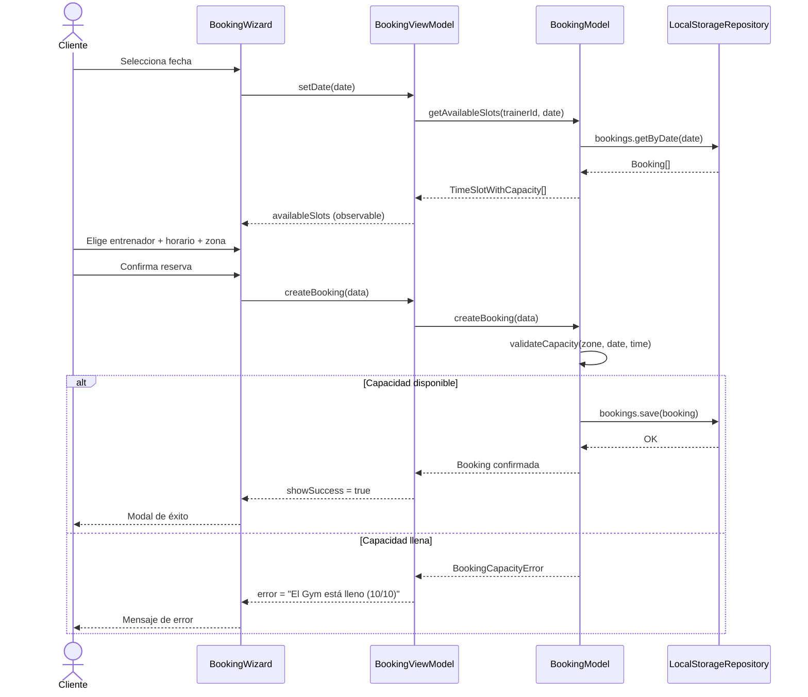

# Feature: Flujo de Reserva del Cliente

## Contexto

Los clientes del gimnasio Nivel necesitan poder reservar sesiones de entrenamiento de forma
autónoma, eligiendo fecha, entrenador, horario y zona (Gym o Gabinete). El sistema debe
controlar el aforo por zona y horario para evitar sobreventa de sesiones.

Este es el flujo core de la aplicación. Toda la arquitectura MVVM está construida
en torno a este caso de uso.

## Roles Involucrados

- **Cliente**: Usuario que reserva sesiones en el gimnasio
- **Entrenador**: Personal del gimnasio con disponibilidad registrada
- **Sistema**: nivel-ui con persistencia en localStorage

## Casos de Uso (Gherkin)

### Escenario 1: Cliente reserva exitosamente en zona Gym

```gherkin
Feature: Reserva de Sesión de Entrenamiento
  As a cliente del gimnasio
  I want to reservar una sesión con un entrenador
  So that puedo planificar mi entrenamiento con disponibilidad garantizada

  Scenario: Cliente reserva exitosamente en zona Gym
    Given el entrenador "Carlos" tiene disponibilidad el "2026-04-15" a las "09:00"
    And el Gym tiene capacidad disponible (menos de 10 reservas en ese horario)
    When el cliente selecciona la fecha "2026-04-15"
    And selecciona al entrenador "Carlos" en el horario "09:00"
    And elige la zona "Gym"
    And confirma la reserva
    Then la reserva queda con estado "confirmed"
    And el cliente ve el modal de éxito con los detalles de la reserva
    And el aforo del Gym en ese horario aumenta en 1
```

### Escenario 2: Cliente reserva exitosamente en zona Gabinete

```gherkin
  Scenario: Cliente reserva en Gabinete (capacidad 1)
    Given el entrenador "Carlos" tiene disponibilidad el "2026-04-15" a las "10:00"
    And el Gabinete NO tiene reservas en ese horario
    When el cliente elige la zona "Gabinete" y confirma
    Then la reserva queda confirmada
    And el Gabinete muestra "1/1" (aforo completo para ese horario)
```

### Escenario 3: Reserva rechazada por aforo del Gym lleno

```gherkin
  Scenario: Gym lleno — reserva rechazada
    Given el Gym tiene 10 reservas en el horario "09:00" del "2026-04-15"
    When el cliente intenta reservar en ese horario y zona "Gym"
    Then el sistema lanza BookingCapacityError
    And el cliente ve el mensaje "El Gym está lleno (10/10)"
    And no se crea ninguna reserva
```

### Escenario 4: Reserva rechazada por aforo del Gabinete lleno

```gherkin
  Scenario: Gabinete ocupado — reserva rechazada
    Given el Gabinete tiene 1 reserva en el horario "10:00" del "2026-04-15"
    When el cliente intenta reservar en ese horario y zona "Gabinete"
    Then el sistema lanza BookingCapacityError
    And el cliente ve el mensaje "El Gabinete está lleno (1/1)"
```

### Escenario 5: Entrenador puede reservar para un cliente

```gherkin
  Scenario: Entrenador crea reserva en nombre de un cliente
    Given el entrenador está autenticado en su panel
    And tiene disponibilidad en un horario
    When selecciona un cliente y completa el flujo de reserva
    Then la reserva se crea con el clientId del cliente seleccionado
    And aparece en la vista de citas del entrenador
```

## Contratos TypeScript

> Interfaces actualmente implementadas en `src/core/types/index.ts` y `src/core/types/errors.ts`.

```typescript
// Entidades de dominio
export interface Booking {
  id: string;
  clientId: string;
  trainerId: string;
  trainerName: string;
  date: Date;
  time: string;
  duration: number; // minutos
  zone: ZoneType;   // 'gym' | 'gabinete'
  status: 'confirmed' | 'cancelled' | 'pending';
}

export type ZoneType = 'gym' | 'gabinete';

// Configuración de capacidad por zona
export const ZONE_CONFIG = {
  gym:      { maxCapacity: 10 },  // por entrenador
  gabinete: { maxCapacity: 1  },  // global
};

// Slot con información de aforo (para la UI)
export interface TimeSlotWithCapacity {
  time: string;
  count: number;
  totalCapacity: number;
  gymOccupancy?: number;
  gabineteOccupancy?: number;
  bookings: Booking[];
}

// Errores de dominio
export class BookingCapacityError extends Error {
  constructor(zone: ZoneType, current: number, max: number);
  // Mensaje: "El [Gym|Gabinete] está lleno (current/max)"
}
```

## Criterios de Aceptación

> Si todos estos tests pasan → spec cumplida.

### Funcionales
- [x] El cliente puede ver un calendario con los días disponibles
- [x] Al seleccionar una fecha, se listan los entrenadores con sus horarios disponibles
- [x] Cada horario muestra el aforo actual (ej: `3/10`)
- [x] El cliente puede elegir zona: Gym o Gabinete
- [x] Al confirmar, la reserva se persiste con estado `confirmed`
- [x] Si el aforo está lleno, se muestra un error claro y no se crea la reserva
- [x] El entrenador puede crear una reserva en nombre de un cliente

### No Funcionales
- [x] Los componentes clave tienen `data-testid` para tests E2E
- [x] El flujo funciona en mobile, tablet y desktop (responsive)

### Tests Requeridos
- [x] Test unitario: `tests/unit/core/models/BookingModel.test.ts`
- [x] Test de ViewModel: `tests/unit/core/view-models/BookingViewModel.test.ts`
- [ ] Test E2E del happy path: `e2e/booking-flow.spec.ts`
- [ ] Test E2E de error de aforo: `e2e/capacity.spec.ts`

## Diagrama de Flujo



## ADRs Relacionados

- [ADR-001: Adoptar Spec Driven Development](../adr/ADR-001-spec-driven-development.md)

## Notas de Implementación

- **Model**: `src/core/models/BookingModel.ts`
- **ViewModel**: `src/core/view-models/BookingViewModel.ts`
- **Componentes**: `src/components/BookingWizard.tsx`, `src/components/CalendarStep.tsx`,
  `src/components/TimeGridStep.tsx`, `src/components/ConfirmationModal.tsx`
- **Tests unitarios**: `tests/unit/core/models/BookingModel.test.ts`
- **Tests E2E pendientes**: `e2e/booking-flow.spec.ts`, `e2e/capacity.spec.ts`
