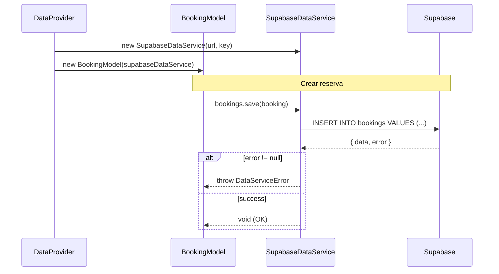

# Feature: SupabaseDataService — Capa de Persistencia con Supabase

## Contexto

El sistema actual persiste los datos en `localStorage` a través de `LocalStorageDataService`,
que implementa `IDataService`. Para el MVP productivo, necesitamos reemplazar esa implementación
con una que use Supabase (PostgreSQL) como backend compartido, de modo que los 30 clientes
y los 2 entrenadores lean y escriban en la misma base de datos.

Gracias al principio **Open/Closed** de la arquitectura actual (OCP), este cambio consiste en
agregar `SupabaseDataService implements IDataService` **sin modificar** `BookingModel`,
`TrainerViewModel`, ni ningún componente existente.

**Prerequisito**: `supabase-schema.spec.md` implementada (tablas y RLS configurados).
**ADR relacionado**: [ADR-002: Estrategia de Despliegue a Producción MVP](../adr/ADR-002-produccion-mvp-deployment.md)

## Roles Involucrados

- **Sistema**: nivel-ui que persiste datos en Supabase en lugar de localStorage
- **Cliente**: Beneficiario — sus reservas persisten en la nube
- **Entrenador**: Beneficiario — ve las reservas de todos los clientes en tiempo real

## Casos de Uso (Gherkin)

### Escenario 1: Cliente crea una reserva que queda persistida en Supabase

```gherkin
Feature: Persistencia de reservas en Supabase
  As a cliente autenticado
  I want que mis reservas se persistan en la nube
  So that mi entrenador puede verlas desde su dispositivo

  Scenario: Cliente crea reserva y entrenador la ve en tiempo real
    Given el cliente "alice" está autenticado
    And el entrenador "carlos" tiene disponibilidad el "2026-05-01" a las "09:00"
    When alice completa el flujo de reserva y confirma
    Then la reserva queda guardada en la tabla bookings de Supabase
    And cuando carlos recarga su panel, ve la reserva de alice
```

### Escenario 2: SupabaseDataService es intercambiable con LocalStorageDataService

```gherkin
  Scenario: El DataProvider inyecta SupabaseDataService en producción
    Given la variable de entorno NEXT_PUBLIC_SUPABASE_URL está configurada
    When el DataProvider se inicializa
    Then inyecta SupabaseDataService en lugar de LocalStorageDataService
    And BookingModel funciona sin ningún cambio en su código
```

### Escenario 3: Errores de Supabase se traducen a DomainErrors

```gherkin
  Scenario: Error de red en Supabase se traduce a error de dominio
    Given la conexión a Supabase falla temporalmente
    When el cliente intenta crear una reserva
    Then SupabaseDataService lanza un DataServiceError
    And el BookingViewModel muestra "Error al guardar la reserva. Intenta de nuevo."
    And no queda ninguna reserva parcialmente guardada
```

## Contratos TypeScript

```typescript
// src/core/services/SupabaseDataService.ts

import { createClient, SupabaseClient } from '@supabase/supabase-js';
import { IDataService } from '@/core/types';
import { DataServiceError } from '@/core/types/errors';

export class SupabaseDataService implements IDataService {
  private supabase: SupabaseClient;

  constructor(supabaseUrl: string, supabaseAnonKey: string) {
    this.supabase = createClient(supabaseUrl, supabaseAnonKey);
  }

  bookings: {
    getByDate(date: string): Promise<Booking[]>;
    getByClientId(clientId: string): Promise<Booking[]>;
    getAll(): Promise<Booking[]>;      // solo para entrenadores (RLS garantiza esto)
    save(booking: Booking): Promise<void>;
    delete(id: string): Promise<void>;
  };

  trainers: {
    getAll(): Promise<Trainer[]>;
    getById(id: string): Promise<Trainer | null>;
    getSchedule(trainerId: string, date: string): Promise<TrainerSchedule | null>;
  };
}

// src/core/types/errors.ts — Nuevo error de dominio
export class DataServiceError extends Error {
  constructor(operation: string, cause?: Error) {
    super(`Error en operación de datos: ${operation}`);
    this.name = 'DataServiceError';
    this.cause = cause;
  }
}
```

## Criterios de Aceptación

> Si todos estos tests pasan → spec cumplida.

### Funcionales

- [ ] `SupabaseDataService` implementa `IDataService` al 100% (TypeScript valida esto)
- [ ] `DataProvider` inyecta `SupabaseDataService` cuando `NEXT_PUBLIC_SUPABASE_URL` está definida
- [ ] `DataProvider` inyecta `LocalStorageDataService` como fallback (para desarrollo local sin Supabase)
- [ ] `bookings.save()` persiste la reserva en la tabla `bookings` de Supabase
- [ ] `bookings.getByDate()` retorna solo las reservas del cliente autenticado (RLS aplicado)
- [ ] `trainers.getAll()` retorna todos los entrenadores activos
- [ ] Los errores de Supabase se capturan y se re-lanzan como `DataServiceError`
- [ ] `BookingModel`, `TrainerModel` y todos los ViewModels funcionan sin cambios

### No Funcionales

- [ ] Las credenciales de Supabase se leen desde variables de entorno, nunca hardcodeadas
- [ ] El cliente de Supabase se crea una sola vez (singleton) para evitar conexiones duplicadas

### Tests Requeridos

- [ ] Test unitario: `tests/unit/core/services/SupabaseDataService.test.ts`
  - Mockea el cliente de Supabase (`@supabase/supabase-js`)
  - Verifica que los métodos llaman a las queries correctas
  - Verifica que los errores de Supabase se traducen a `DataServiceError`
- [ ] Test de integración: `tests/integration/SupabaseDataService.integration.test.ts`
  - Usa un proyecto Supabase de testing (con variables de entorno de CI)
  - Verifica el flujo completo: `BookingModel` → `SupabaseDataService` → Supabase

## Diagrama de Flujo



## ADRs Relacionados

- [ADR-002: Estrategia de Despliegue a Producción MVP](../adr/ADR-002-produccion-mvp-deployment.md)

## Notas de Implementación

> Completar cuando esté implementado.

- **Servicio**: `src/core/services/SupabaseDataService.ts`
- **Provider**: `src/providers/DataProvider.tsx` (modificación para inyección condicional)
- **Tipos**: `src/core/types/supabase.ts` (de la spec `supabase-schema`)
- **Error**: `src/core/types/errors.ts` — agregar `DataServiceError`
- **Tests unitarios**: `tests/unit/core/services/SupabaseDataService.test.ts`
- **Tests de integración**: `tests/integration/SupabaseDataService.integration.test.ts`
