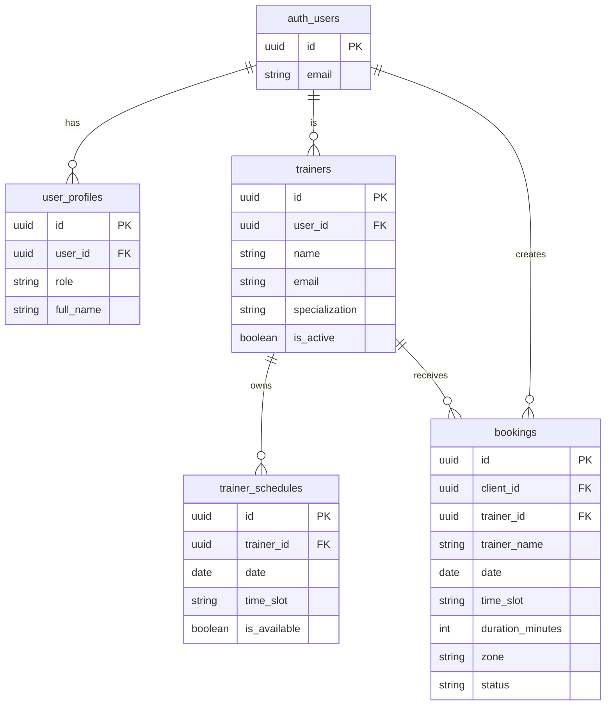

# Feature: Schema SQL y Migraciones en Supabase

## Contexto

El sistema actual usa `localStorage` como capa de persistencia, lo que hace que los datos sean
**por dispositivo** — el entrenador no puede ver las reservas de los clientes. Para el MVP con
30 clientes y 2 entrenadores, necesitamos una base de datos compartida en PostgreSQL (Supabase).

Esta spec define el schema de base de datos que refleja el modelo de dominio actual, incluyendo
las políticas de Row Level Security (RLS) que garantizan que cada usuario solo acceda a los
datos que le corresponden.

**ADR relacionado**: [ADR-002: Estrategia de Despliegue a Producción MVP](../adr/ADR-002-produccion-mvp-deployment.md)

## Roles Involucrados

- **Cliente**: Usuario que reserva sesiones — solo ve sus propias reservas
- **Entrenador**: Personal del gimnasio — ve todas las reservas y gestiona disponibilidad
- **Sistema**: nivel-ui con Supabase como backend

## Casos de Uso (Gherkin)

### Escenario 1: Cliente solo puede ver sus propias reservas (RLS)

```gherkin
Feature: Row Level Security en bookings
  As a sistema de seguridad de datos
  I want garantizar que cada usuario solo acceda a sus propios datos
  So that la privacidad de los clientes está protegida

  Scenario: Cliente autenticado solo ve sus reservas
    Given el cliente "alice@gym.com" está autenticado
    And existen reservas de alice y de "bob@gym.com" en la base de datos
    When alice consulta la tabla bookings
    Then solo obtiene las reservas donde client_id = alice.id
    And las reservas de bob NO aparecen en el resultado
```

### Escenario 2: Entrenador puede ver todas las reservas

```gherkin
  Scenario: Entrenador autenticado ve todas las reservas
    Given el entrenador "carlos@gym.com" está autenticado con rol "trainer"
    And existen reservas de múltiples clientes en la base de datos
    When carlos consulta la tabla bookings
    Then obtiene todas las reservas de todos los clientes
    And puede filtrar por trainer_id para ver solo sus citas
```

### Escenario 3: Entrenador gestiona su disponibilidad

```gherkin
  Scenario: Entrenador registra disponibilidad
    Given el entrenador "carlos@gym.com" está autenticado con rol "trainer"
    When carlos inserta un registro en trainer_schedules para "2026-05-01" a las "09:00"
    Then el registro queda disponible para que los clientes consulten horarios
    And un cliente puede leer trainer_schedules pero NO modificar registros ajenos
```

### Escenario 4: Usuario anónimo solo puede leer datos públicos

```gherkin
  Scenario: Acceso anónimo restringido a datos públicos
    Given un usuario no autenticado
    When consulta la tabla trainers
    Then obtiene la lista de entrenadores activos
    When intenta insertar en bookings
    Then recibe un error de permisos (RLS denied)
```

## Contratos TypeScript

> Estos tipos deben coincidir exactamente con las columnas de Supabase para garantizar type safety.

```typescript
// src/core/types/supabase.ts — Tipos generados o manuales de Supabase

export type UserRole = 'client' | 'trainer';

export interface TrainerRow {
  id: string;               // UUID, PK
  user_id: string;          // UUID, FK → auth.users.id
  name: string;
  email: string;
  specialization: string | null;
  is_active: boolean;
  created_at: string;       // ISO timestamp
}

export interface TrainerScheduleRow {
  id: string;               // UUID, PK
  trainer_id: string;       // UUID, FK → trainers.id
  date: string;             // YYYY-MM-DD
  time_slot: string;        // HH:MM
  is_available: boolean;
  created_at: string;
}

export interface BookingRow {
  id: string;               // UUID, PK
  client_id: string;        // UUID, FK → auth.users.id
  trainer_id: string;       // UUID, FK → trainers.id
  trainer_name: string;     // Desnormalizado para performance
  date: string;             // YYYY-MM-DD
  time_slot: string;        // HH:MM
  duration_minutes: number;
  zone: 'gym' | 'gabinete';
  status: 'confirmed' | 'cancelled' | 'pending';
  created_at: string;
}

export interface UserProfileRow {
  id: string;               // UUID, PK = auth.users.id
  role: UserRole;
  full_name: string | null;
  created_at: string;
}
```

## Criterios de Aceptación

> Si todos estos tests pasan → spec cumplida.

### Funcionales

- [ ] Las tablas `trainers`, `trainer_schedules`, `bookings`, `user_profiles` existen en Supabase
- [ ] RLS activado: un cliente autenticado NO puede leer reservas de otro cliente
- [ ] RLS activado: un entrenador autenticado SÍ puede leer todas las reservas
- [ ] RLS activado: un entrenador SÍ puede insertar/actualizar sus propios `trainer_schedules`
- [ ] RLS activado: un usuario anónimo puede leer `trainers` y `trainer_schedules` pero no insertar en `bookings`
- [ ] Las migraciones se pueden aplicar desde cero con `supabase db reset`
- [ ] Los índices de performance existen en `bookings(date, trainer_id)` y `trainer_schedules(trainer_id, date)`

### No Funcionales

- [ ] El schema usa UUIDs como PKs (no enteros secuenciales)
- [ ] Todos los timestamps usan `timestamptz` con default `now()`
- [ ] Las claves foráneas tienen `ON DELETE CASCADE` donde corresponde

### Tests Requeridos

- [ ] Test de integración: `tests/integration/supabase-rls.integration.test.ts`
  - Verifica RLS cliente→booking
  - Verifica RLS entrenador→booking
  - Verifica acceso anónimo a trainers
- [ ] Seed data en `supabase/seed.sql` con los 2 entrenadores del MVP

## Diagrama de Flujo



## ADRs Relacionados

- [ADR-002: Estrategia de Despliegue a Producción MVP](../adr/ADR-002-produccion-mvp-deployment.md)

## Notas de Implementación

- **Migraciones**: `supabase/migrations/20260411000000_initial_schema.sql` (tablas + índices), `supabase/migrations/20260411000001_rls_policies.sql` (RLS)
- **Seed**: `supabase/seed.sql` — 2 entrenadores del MVP (Carlos Rodríguez, María González)
- **Tipos**: `src/core/types/supabase.ts`
- **Tests**: `tests/integration/supabase-rls.integration.test.ts` — verifica RLS con simulación TypeScript de las políticas SQL
