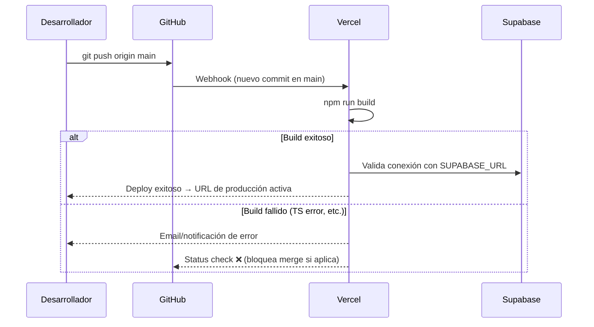

# Feature: Configurar Despliegue en Vercel

## Contexto

Una vez que `SupabaseDataService` y la autenticación están implementados, necesitamos
desplegar la aplicación en Vercel para que los 30 clientes y 2 entrenadores puedan
acceder al MVP desde cualquier dispositivo.

Vercel es la plataforma recomendada por ADR-002 para hospedar el frontend Next.js: soporta
App Router nativamente, despliega automáticamente desde GitHub, y genera preview deployments
por cada PR para facilitar la revisión de cambios.

**Prerequisito**: `supabase-data-service.spec.md` y `auth.spec.md` implementadas.
**ADR relacionado**: [ADR-002: Estrategia de Despliegue a Producción MVP](../adr/ADR-002-produccion-mvp-deployment.md)

## Roles Involucrados

- **DevOps/Dev**: Configura Vercel, variables de entorno y pipeline de CI/CD
- **Cliente / Entrenador**: Acceden al MVP en producción desde la URL de Vercel

## Casos de Uso (Gherkin)

### Escenario 1: Deploy automático desde main

```gherkin
Feature: Despliegue continuo en Vercel
  As a desarrollador
  I want que cada merge a main despliegue automáticamente a producción
  So that las nuevas features llegan a los usuarios sin pasos manuales

  Scenario: Merge a main dispara deploy de producción
    Given el proyecto está conectado a Vercel
    And las variables de entorno de producción están configuradas en Vercel
    When se hace merge de un PR a la rama main
    Then Vercel ejecuta `npm run build` automáticamente
    And despliega la nueva versión en la URL de producción
    And el deploy es visible en el dashboard de Vercel
```

### Escenario 2: Preview deployment por PR

```gherkin
  Scenario: PR genera preview deployment
    Given el proyecto está conectado a Vercel con preview deployments activos
    When se abre un PR contra main
    Then Vercel genera una URL de preview única para ese PR
    And el bot de Vercel comenta la URL en el PR de GitHub
    And el reviewer puede probar la feature antes del merge
```

### Escenario 3: Variables de entorno separadas por ambiente

```gherkin
  Scenario: Producción usa credenciales de Supabase de producción
    Given existen dos proyectos en Supabase: "nivel-prod" y "nivel-dev"
    When la app se despliega en producción (rama main)
    Then usa NEXT_PUBLIC_SUPABASE_URL y SUPABASE_SERVICE_KEY del proyecto "nivel-prod"
    When se genera un preview deployment
    Then usa las variables del proyecto "nivel-dev"
    And los datos de desarrollo nunca se mezclan con los de producción
```

### Escenario 4: Build falla si hay errores de TypeScript

```gherkin
  Scenario: CI bloquea deploy con errores de TypeScript
    Given existe un error de tipos en el código
    When Vercel ejecuta `npm run build`
    Then el build falla con el error de TypeScript
    And el deploy NO se realiza
    And el PR queda bloqueado hasta que el error se corrija
```

## Contratos TypeScript

> No hay contratos de dominio nuevos. Esta spec es principalmente de infraestructura y configuración.

```typescript
// Variables de entorno requeridas (en .env.local para desarrollo)
// NEXT_PUBLIC_SUPABASE_URL=https://[proyecto].supabase.co
// NEXT_PUBLIC_SUPABASE_ANON_KEY=eyJ...
// SUPABASE_SERVICE_ROLE_KEY=eyJ...  (solo server-side, nunca expuesto al cliente)

// src/lib/supabase/client.ts — Cliente singleton para el browser
import { createBrowserClient } from '@supabase/ssr';

export function createSupabaseClient() {
  return createBrowserClient(
    process.env.NEXT_PUBLIC_SUPABASE_URL!,
    process.env.NEXT_PUBLIC_SUPABASE_ANON_KEY!
  );
}
```

## Criterios de Aceptación

> Si todos estos checks pasan → spec cumplida.

### Funcionales

- [ ] El proyecto está conectado a Vercel desde el repositorio de GitHub
- [ ] Cada push a `main` dispara un deploy de producción automático
- [ ] Cada PR genera un preview deployment con URL única
- [ ] Las variables de entorno de Supabase están configuradas en Vercel (producción y preview por separado)
- [ ] La URL de producción es accesible y funciona el flujo completo de reserva
- [ ] El build de Vercel usa `npm run build` y pasa TypeScript strict

### No Funcionales

- [ ] `SUPABASE_SERVICE_ROLE_KEY` está marcada como "Sensitive" en Vercel (no se expone en logs)
- [ ] El dominio de producción está en `vercel.app` o dominio personalizado si aplica
- [ ] Los headers de seguridad están configurados en `next.config.ts` (`X-Frame-Options`, `CSP`)

### Checklist de Configuración (no automatizable con tests)

- [ ] Proyecto creado en vercel.com y vinculado al repo `rcastillejo/nivel-ui`
- [ ] Variables de entorno configuradas en Vercel Dashboard:
  - `NEXT_PUBLIC_SUPABASE_URL` (Production + Preview)
  - `NEXT_PUBLIC_SUPABASE_ANON_KEY` (Production + Preview)
- [ ] `.env.local` agregado a `.gitignore` (nunca commitear credenciales)
- [ ] `.env.example` creado con las variables requeridas (sin valores reales)

### Tests Requeridos

- [ ] Test E2E en producción: `e2e/smoke.spec.ts`
  - Verifica que la URL de producción responde con HTTP 200
  - Verifica que la pantalla de login carga correctamente
  - Verifica que el flujo de login funciona con un usuario de prueba
- [ ] CI Check: `npm run build` en GitHub Actions antes de merge

## Diagrama de Flujo



## ADRs Relacionados

- [ADR-002: Estrategia de Despliegue a Producción MVP](../adr/ADR-002-produccion-mvp-deployment.md)

## Notas de Implementación

> Completar cuando esté implementado.

- **Config**: `next.config.ts` — headers de seguridad
- **Env template**: `.env.example`
- **Supabase client**: `src/lib/supabase/client.ts`
- **Tests de smoke**: `e2e/smoke.spec.ts`
- **URL de producción**: (completar con la URL de Vercel asignada)
